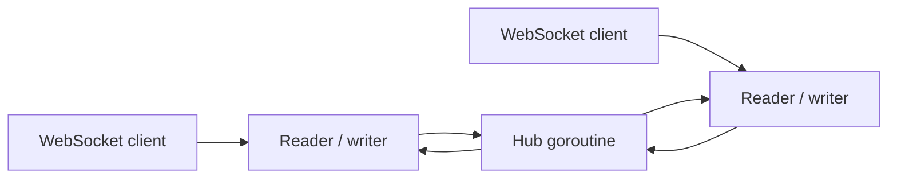

# Architecture

The first milestone is intentionally small: one Go process owns all active connections through a
single hub goroutine. This makes connection membership race-free without a shared map mutex.



## Concurrency model

- One reader and one writer operate per WebSocket connection.
- The hub goroutine exclusively owns the connection map.
- Bounded send buffers apply backpressure; persistently slow consumers are disconnected.
- Inbound messages are limited to 16 KiB and validated before broadcast.
- HTTP and WebSocket work stop through context cancellation and graceful server shutdown.

## Event contract

The v0.1 event accepted from clients is:

```json
{
  "type": "message.created",
  "room_id": "demo-room",
  "payload": {"text": "hello"}
}
```

The server adds an event ID and UTC timestamp. Room authorization, persistence, JWT authentication,
Redis fan-out, and delivery receipts are deliberately reserved for later milestones.
